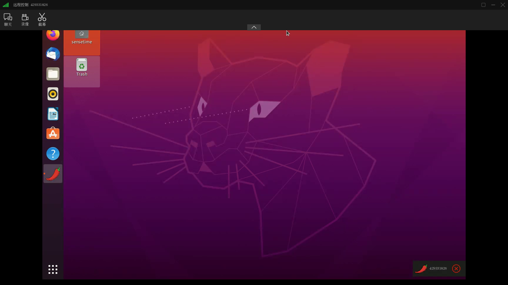

# dkp4j

## 前言

`dkp4j`项目致力于打造一个开源、免费、自由部署的远程控制工具。

## 项目介绍

### 通信协议

|    单元格     |    0    |   1   |    2     |   3-6   |  7-10   |  11-14   |  15-18    | 16-20    |   ........  |
|--------------|---------|-------|--------- |---------|---------|----------|-----------|----------|-------------|
|  代表一个字节  |    X    |   Z   |  指令类型 |  目标地址 | 源地址   |  消息状态 |  数据长度  |   消息方向 |    数据     |

#### 指令类型

```lua
    UNKNOWN((byte) -1, "未知指令"),
    HEART_BEAT((byte) 0, "客户端心跳"),
    UPDATE_CLIENT_CODE((byte) 1, "更新客户端识别码"),
    REQUEST_REMOTE((byte) 2, "请求远程控制"),
    MOUSE_ACTIVE((byte) 3, "鼠标动作");
    .....
```

更多指令请看:[SocketMD](./kit/src/main/java/cn/navclub/xtm/kit/enums/SocketCMD.java)

#### 消息状态

```lua
    OK(200, "操作成功"),
    UNKNOWN(-1,"未知状态"),
    CLIENT_BUSY(1000, "占线中"),
    OFFLINE(1001, "客户端离线"),
    UNAUTHORIZED(1002,"远程口令错误");
```

更多状态请看:[ClientStatus](./kit/src/main/java/cn/navclub/xtm/kit/enums/SocketCMD.java)

#### 消息方向

```lua
    /**
     * 请求
     */
    REQUEST((byte) 0),
    /**
     * 响应
     */
    RESPONSE((byte) 1);
```

更多方向请看:[TCPDirection](./kit/src/main/java/cn/navclub/xtm/kit/enums/TCPDirection.java)

### 组织结构

```lua
dpk4j
├── x-core -- 项目核心模块
├── x-server -- 服务端相关代码
├── x-app -- 用户界面交互相关代码
└── x-kit -- 与服务器交互相关代码
```

### 程序快照




### 技术选型

| 技术                 | 说明                | 官网                                           |
| -------------------- | ------------------- | ---------------------------------------------- |
| Javafx               | 新生代java GUI框架    | https://openjfx.io/         |
| FFmpeg               | 视屏、音频转换为流的开源计算机程序      | http://ffmpeg.org/     |
| Vertx                | JVM平台网络编程工具箱             | https://vertx.io/ |

### 开发工具

| 工具          | 说明                | 官网                                            |
| ------------- | ------------------- | ----------------------------------------------- |
| IDEA          | 开发IDE              | https://www.jetbrains.com/idea/download         |
| VLC           | 视屏流调试工具         | https://www.videolan.org/                       |

## 开发环境

| 工具          | 版本号 | 下载                                                         |
| ------------- | ------ | ------------------------------------------------------------ |
| JDK           | 17    | https://www.injdk.cn/ |
| Nginx         | 1.21.3   | http://nginx.org/en/download.html                            |

## 许可证

[Apache License 2.0](./LICENSE)

Copyright (c) 2018-2021 navclub.cn